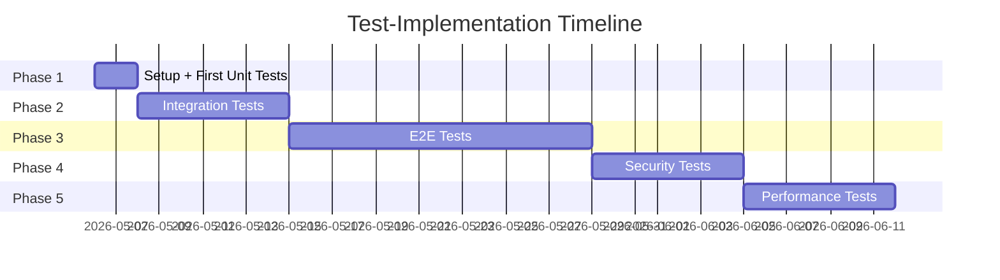

# 🧪 Testing Status — HydraHive2

> **Last Updated:** 2026-05-06  
> **Status:** 🔴 **NO TESTS — CRITICAL**

---

## 📊 Quick Stats

```
┌─────────────────────────────────────────────────────────┐
│                    TEST COVERAGE                        │
├─────────────────────────────────────────────────────────┤
│  Unit Tests:          ❌ 0%  (0 tests)                  │
│  Integration Tests:   ❌ 0%  (0 tests)                  │
│  E2E Tests:           ❌ 0%  (0 tests)                  │
│  Overall Coverage:    ❌ 0%                             │
├─────────────────────────────────────────────────────────┤
│  Python Files:        304                               │
│  Lines of Code:       ~16,050                           │
│  API Endpoints:       ~250-400 (ungetestet)            │
│  Critical Modules:    8 (alle ohne Tests)              │
└─────────────────────────────────────────────────────────┘
```

---

## 🚨 Risk Assessment

### Critical Modules (EXTREM HOCH)

| Modul | Risiko | Grund | Tests |
|-------|--------|-------|-------|
| **Agent Runner** | 🔴🔴🔴 | Kern-Loop, Tool-Execution | 0 |
| **Compaction** | 🔴🔴🔴 | Context-Shrinking, Datenverlust | 0 |
| **LLM Client** | 🔴🔴 | API-Calls, Provider-Switching | 0 |
| **shell_exec** | 🔴🔴 | Security-kritisch | 0 |
| **Auth/JWT** | 🔴🔴 | User-Isolation, Security | 0 |
| **AgentLink** | 🔴🔴 | State-Transfer zwischen Agents | 0 |
| **DB-Layer** | 🔴 | Session/Message-Persistence | 0 |
| **File-Tools** | 🔴 | Path-Traversal-Risiko | 0 |

**Gesamt-Risiko:** 🔴 **SEHR HOCH**

---

## 📋 Quick Links

- 📖 [**Vollständiger Deep-Dive Report**](./TEST_DEEP_DIVE.md)
- ✅ [**Test-Implementation Checklist**](./TEST_CHECKLIST.md)
- 🚀 [**Quick-Start Guide**](#quick-start-tests-in-1-stunde)

---

## 🎯 Roadmap



### Milestones

- [ ] **Week 1:** 40% Coverage (Critical Path)
- [ ] **Month 1:** 60% Coverage (Core Modules)
- [ ] **Month 3:** 80% Coverage (Full System)

---

## 🚀 Quick-Start: Tests in 1 Stunde

```bash
# 1. Setup Test-Verzeichnis
cd hydrahive20server/core
mkdir -p tests/{unit,integration}

# 2. Basis-Fixtures
cat > tests/conftest.py << 'PYTEST'
import pytest
from pathlib import Path

@pytest.fixture
def tmp_workspace(tmp_path):
    ws = tmp_path / "workspace"
    ws.mkdir()
    return ws
PYTEST

# 3. Dependencies installieren
pip install pytest pytest-asyncio pytest-cov httpx

# 4. Erster Test (file_write)
cat > tests/unit/test_file_tools.py << 'TEST'
import pytest
from hydrahive.tools.file_write import _execute
from hydrahive.tools.base import ToolContext

@pytest.mark.asyncio
async def test_file_write_creates_file(tmp_workspace):
    ctx = ToolContext(workspace=tmp_workspace, user_id="test")
    result = await _execute({"path": "test.txt", "content": "Hello"}, ctx)
    assert result.success
    assert (tmp_workspace / "test.txt").read_text() == "Hello"

@pytest.mark.asyncio
async def test_file_write_rejects_path_traversal(tmp_workspace):
    ctx = ToolContext(workspace=tmp_workspace, user_id="test")
    result = await _execute({"path": "../../etc/passwd", "content": "HACKED"}, ctx)
    assert not result.success
TEST

# 5. Ersten Test laufen lassen
pytest tests/unit/test_file_tools.py -v
```

**Erwartung:**  
- ✅ Test zeigt ob file_write korrekt implementiert ist
- ❌ Falls Bugs → sofortige Visibility

---

## 📈 Coverage-Tracking

### Target vs. Actual

```
Week 1:  [ ░░░░░░░░░░░░░░░░░░░░ ] 0% / 40%  (Target)
Week 2:  [ ░░░░░░░░░░░░░░░░░░░░ ] 0% / 50%
Week 3:  [ ░░░░░░░░░░░░░░░░░░░░ ] 0% / 60%
Week 4:  [ ░░░░░░░░░░░░░░░░░░░░ ] 0% / 70%
Month 3: [ ░░░░░░░░░░░░░░░░░░░░ ] 0% / 80%
```

*(Update nach jedem Test-Run)*

---

## 🔧 CI/CD Integration

### Geplante GitHub Actions

```yaml
name: Tests
on: [push, pull_request]

jobs:
  test:
    runs-on: ubuntu-latest
    steps:
      - uses: actions/checkout@v3
      - uses: actions/setup-python@v4
        with:
          python-version: '3.12'
      - run: pip install -e core[test]
      - run: pytest tests/ --cov=hydrahive --cov-report=xml
      - uses: codecov/codecov-action@v3
```

**Status:** ❌ Noch nicht implementiert

---

## 🐛 Known Issues (ohne Tests entdeckt)

| ID | Modul | Beschreibung | Severity |
|----|-------|--------------|----------|
| - | - | *(Keine formalen Bug-Reports ohne Tests)* | - |

**Problem:** Ohne Tests = keine systematische Bug-Discovery

---

## 📚 Best Practices (für Tests)

### ✅ DO
- Mock externe Services (LLM-APIs, AgentLink)
- Nutze Fixtures für wiederverwendbare Setup-Logik
- Tests sollten <10s laufen (Unit) / <1min (Integration)
- Ein Test = eine Assertion (fokussiert)
- Test-Namen beschreiben das Verhalten: `test_user_cannot_access_other_users_sessions`

### ❌ DON'T
- Keine Flaky-Tests (Timing-abhängig)
- Keine Test-zu-Test-Dependencies
- Keine echten LLM-API-Calls in Tests (teuer + langsam)
- Keine Production-DB in Tests

---

## 🎓 Resources

- [pytest Documentation](https://docs.pytest.org/)
- [FastAPI Testing Guide](https://fastapi.tiangolo.com/tutorial/testing/)
- [pytest-asyncio Docs](https://pytest-asyncio.readthedocs.io/)
- [Effective Python Testing](https://realpython.com/python-testing/)

---

## 📝 Next Actions

### Immediate (Today)
1. ✅ Deep-Dive Report erstellt
2. ⏳ Mit Till besprechen
3. ⏳ Phase 1 Setup starten

### This Week
4. ⏳ Erste 10 Unit-Tests schreiben
5. ⏳ CI-Pipeline einrichten
6. ⏳ 40% Coverage erreichen

### This Month
7. ⏳ Integration-Tests
8. ⏳ Security-Tests
9. ⏳ 60% Coverage

---

**Status-Legende:**
- ✅ Done
- ⏳ In Progress / Planned
- ❌ Blocked / Not Started
- 🔴 High Risk
- 🟡 Medium Risk
- 🟢 Low Risk
